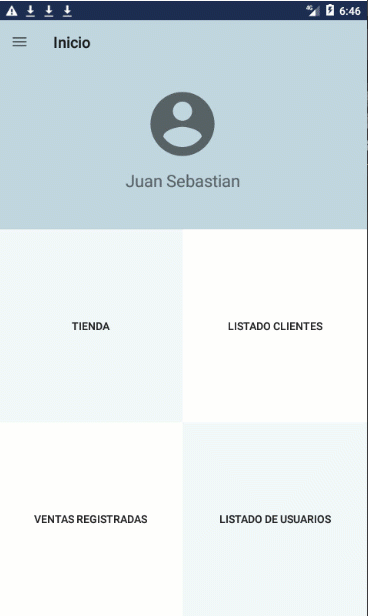

# GestionInventariosSyM
Aplicativo para manejo de inventarios.
Realizado aplicando arquitectura tres capas y modelo MVC.

Inicio de sesión, funcionalidades de la aplicación, registro de usuarios, productos, clientes y ventas.

Registro de productos nuevos en la aplicación.

Creación y eliminación de usuarios, edición de productos.

Registro de ventas en el aplicativo.

Edición y eliminación de clientes

